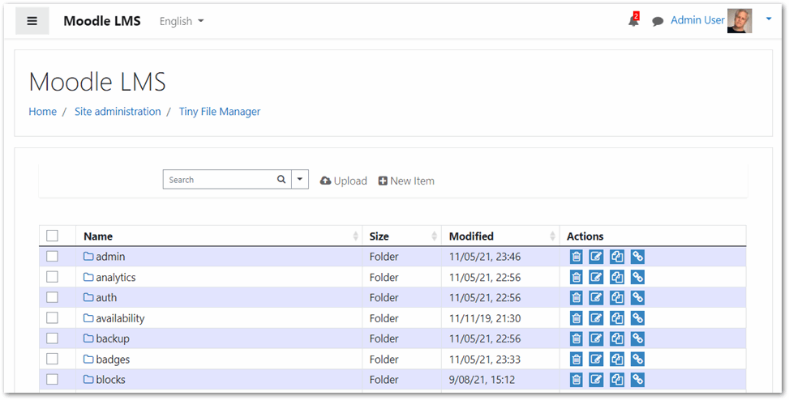

Local TinyFileManager plugin for Moodle
=======================================

IMPORTANT NOTE: This plugin is under development. Use at your own risk!

# Table of Contents

- [Basic Overview](#basic-overview)
- [Requirements](#requirements)
- [Download](#download)
- [Installation](#installation)
- [Usage](#usage)
- [Updating](#updating)
- [Uninstallation](#uninstallation)
- [Limitations](#limitations)
- [Language Support](#language-support)
- [Frequently Asked Questions (FAQ)](#faq)
- [Contributing](#contributing)
- [Motivation for this plugin](#motivation-for-this-plugin)
- [Further information](#further-information)
- [License](#license)

# Basic Overview

This is a port of Tiny File Manager for Moodle LMS. It supports multiple-languages storing, uploading, editing and managing files and folders in your website. The plugin runs on Moodle 3.0+. It includes build-in support for creating and managing text files and it supports syntax highlighting for over 150+ code languages.

Because it can be used by Site Administrators in such a way that your Moodle site can become disabled, we recommend that it only be used by qualified trusted Moodle Site Administrators.

## Demo

[Stand-alone Demo Site](https://tinyfilemanager.github.io/demo/)
Login Details : admin/admin@123 | user/12345

### :loudspeaker: Features

The following features could be anywhere from the conception stage to the finished stage. This plugin is in development.

- :cd: Open Source, light and extremely simple
- :iphone: Mobile friendly view for touch devices
- :information_source: Basic features likes Create, Delete, Modify, View, Quick Preview, Download, Copy and Move files
- :arrow_double_up: Ajax Upload, Ability to drag & drop, upload from URL, multiple files upload with file extensions filter
- :file_folder: Ability to create folders and files
- :gift: Ability to compress, extract files (`zip`, `tar`)
- :floppy_disk: Copy direct file URL
- :pencil2: Syntax highlighting for over `150+` languages, Over `35+` themes with your favorite programming style
- :page_facing_up: Google/Microsoft doc viewer helps you preview `PDF/DOC/XLS/PPT/etc`. 25 MB can be previewed with the Google Drive viewer
- :mag_right: Search - Search and filter files using `datatable js`
- :file_folder: Exclude hidden files and folders from listing
- :top: Configurable root directory.
- :globe_with_meridians: Multi-language(20+) support. Does not use Moodle language packs.
- :bangbang: lots more...

[(Back to top)](#table-of-contents)

# Requirements

- Moodle 3.2 or higher.
- Fileinfo, iconv, zip, tar and mbstring PHP extensions are strongly recommended.

[(Back to top)](#table-of-contents)

# Download

The most development release can be found at:
https://github.com/michael-milette/moodle-local_tinyfilemanager

This plugin is not yet available from:
https://moodle.org/plugins/local_tinyfilemanager

[(Back to top)](#table-of-contents)

# Installation

Install the plugin, like any other plugin, to the following folder:

    /local/tinyfilemanager

See http://docs.moodle.org/en/Installing_plugins for details on installing
Moodle plugins.

There are no special considerations required for updating the plugin.

[(Back to top)](#table-of-contents)

# Usage

## Configuring Settings

Settings for Tiny File Manager can be found by going to Site Administration > Plugins > Local > Tiny File Manager.
## Using

Once installed and configured, Site Administrators can access TinyFileManager by navigating to Site Administration > Server > Tiny File Manager.

[(Back to top)](#table-of-contents)

# Updating

There are no special considerations required for updating the plugin.

The first public ALPHA version was released on 2021-12-12.

For more information on releases since then, see
[CHANGELOG.md](https://github.com/michael-milette/moodle-local_tinyfilemanager/blob/master/CHANGELOG.md).

[(Back to top)](#table-of-contents)

# Uninstallation

Uninstalling the plugin by going into the following:

Home > Administration > Site Administration > Plugins > Manage plugins > Tiny File Manager

...and click Uninstall. You may also need to manually delete the following folder:

    /local/tinyfilemanager

[(Back to top)](#table-of-contents)

## Limitations

- Can only be used by Moodle Site Administrators.

See the [up-to-date list of issues](https://github.com/michael-milette/moodle-local_tinyfilemanager/issues)

## Language Support

This plugin includes support for 150+ languages in addition to English. Note that it does not use Moodle's language packs. Additional languages are provided in the translation.json file included with this plugin.

If you need a different language that is not yet supported, please feel free to submit a pull request to the parent project at https://github.com/prasathmani/tinyfilemanager.

This plugin has not been tested for right-to-left (RTL) language support. If you want to use this plugin with a RTL language and it doesn't work as-is, feel free to submit a pull request to http://github.com/michael-milette/moodle-local_tinyfilemanager

[(Back to top)](#table-of-contents)

## FAQ

Here is a list of known issues:

- The Advanced Editor has display issues in most themes (basic editor is fine).
- Loading of file listing may be a little slow on slower web servers.

For up to date information, please see https://github.com/michael-milette/moodle-local_tinyfilemanager/issues

[(Back to top)](#table-of-contents)

### Are there any security considerations?

This plugin does not have any known security considerations at this time. However, it can be used by Site Administrators in such a way that your Moodle site can become disabled. We recommend that it only be used by qualified trusted Site Administrators.

## Other questions

Got a burning question that is not covered here? If you still can't find your
answer, submit your question in the Moodle forums or open a new issue on
Github at:

https://github.com/michael-milette/moodle-local_tinyfilemanager/issues

[(Back to top)](#table-of-contents)

# Contributing

If you are interested in helping, please take a look at our
[contributing](https://github.com/michael-milette/moodle-local_tinyfilemanager/blob/master/CONTRIBUTING.md)
guidelines for details on our code of conduct and the process for submitting
pull requests to us.

## Contributors

- Michael Milette - Author and Lead Developer of Moodle LMS plugin.
- Original concept and development of stand alone application by github.com/alexantr/filemanager
- Based on stand-alone application fork by [Prasath Mani](https://github.com/prasathmani/tinyfilemanager)
- CDN Used - _jQuery, Bootstrap, Font Awesome, Highlight js, ace js, DropZone js, ekko-lightbox js, and DataTable js_
- To report a bug or request a feature, please file an [issue](https://github.com/michael-milette/moodle-local_tinyfilemanager/issues)
- [Contributors](https://github.com/michael-milette/moodle-local_tinyfilemanager/wiki/Authors-and-Contributors)

[(Back to top)](#table-of-contents)

## Pending Features

Let us know if you have any suggestions.

[(Back to top)](#table-of-contents)

# Motivation for this plugin

The development of this plugin was motivated through our own experience in
Moodle development and comments in the Moodle support forums and is supported
by TNG Consulting Inc.

[(Back to top)](#table-of-contents)

# Further information

For further information regarding the local_tinyfilemanager plugin, support or to
report a bug, please visit the project page at:

https://github.com/michael-milette/moodle-local_tinyfilemanager

[(Back to top)](#table-of-contents)

# License

Copyright © 2019-2022 TNG Consulting Inc. - https://www.tngconsulting.ca/

This file is part of TinyFileManager for Moodle - http://moodle.org/

TinyFileManager is free software: you can redistribute it and/or modify
it under the terms of the GNU General Public License as published by
the Free Software Foundation, either version 3 of the License, or
(at your option) any later version.

TinyFileManager is distributed in the hope that it will be useful,
but WITHOUT ANY WARRANTY; without even the implied warranty of
MERCHANTABILITY or FITNESS FOR A PARTICULAR PURPOSE.  See the
GNU General Public License for more details.

You should have received a copy of the GNU General Public License
along with TinyFileManager.  If not, see <http://www.gnu.org/licenses/>.

[(Back to top)](#table-of-contents)
